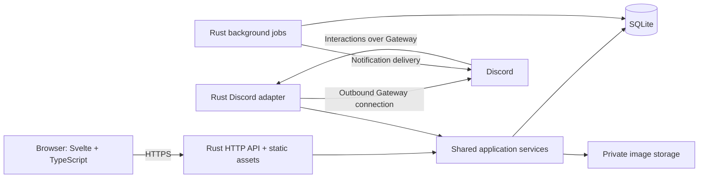

# Taskboard — Project Plan

Status: proposed implementation plan for the first release.

## 1. Purpose and confirmed decisions

Taskboard is a small internal project management website for the company. It will replace the team's everyday use of tools such as Asana, GitHub Projects, and Trello with shared projects, tasks, Markdown content, and Discord notifications.

Confirmed requirements:

- Use **projects**, not a separate products hierarchy.
- All company users can access all projects.
- Users can create projects and create, edit, and delete tasks. Every task always belongs to one project.
- Tasks support due dates, embedded images, and GitHub links.
- Long-form text uses Markdown, including syntax highlighting in fenced code blocks.
- Deleted tasks move to an Archive until explicitly permanently deleted.
- The frontend uses **Svelte and TypeScript**; the backend uses **Rust and SQLite**.
- Authentication happens inside Taskboard using email and password, with credentials stored securely in SQLite.
- The app supports light and dark themes.
- A Discord bot lets linked users list, finish, cancel, and delete tasks, and delivers due-date and watcher activity notifications.

### Proposed defaults

These are planning choices, rather than additional confirmed requirements. They can be adjusted without changing the core architecture.

| Area | First-release default |
| --- | --- |
| Organization | One company workspace, initially sized for tens of employees |
| Registration | Employees register with email and password using an editor-issued invitation |
| Roles | Viewer and editor; shared project visibility for both |
| Assignment | One optional assignee per task |
| Due dates | Optional calendar date, interpreted in the editing user's recorded local time zone; calculated instants are stored in UTC |
| Workflow | To do, In progress, Blocked, Done, Canceled |
| Archive retention | Indefinite until an editor explicitly purges a task |
| Discord | One company Discord server; personal notifications by direct message |
| Hosting | One persistent server or container with local durable storage |
| Media | Uploaded images plus links; arbitrary video and iframe embeds deferred |

## 2. First-release scope

### Projects

- Create a project with a name, unique URL slug, and optional Markdown description.
- Show all active projects with task counts and a recent activity summary.
- Provide a task list and a Kanban board for each project.
- Allow editors to edit, archive, and restore projects. Viewers have read-only access.
- An archived project is read-only and stops generating due reminders. Its tasks remain attached to it, with their existing statuses and individual archive flags preserved.
- Restore the project before editing its tasks or restoring an individually archived task within it.
- Defer permanent project deletion. A database constraint must prevent deleting a project that still has tasks.

### Tasks

| Field | Behavior |
| --- | --- |
| ID | Stable, globally unique reference such as `TB-123`; never reused |
| Project | Required when creating a task; enforced by the backend and database |
| Title | Required plain text, up to 200 characters |
| Description | Optional Markdown with preview, images, links, and code blocks |
| Status | To do, In progress, Blocked, Done, or Canceled |
| Assignee | Optional active company user |
| Due date | Optional date with a visible time-zone interpretation |
| Watchers | Users who subscribe to task activity |
| GitHub links | Zero or more repository, issue, pull request, or commit URLs |
| History | Creator, creation/update times, and a chronological activity feed |
| Archive metadata | Who deleted the task and when |

- Create tasks from a project or from a global action that requires selecting a project.
- Edit the title, description, status, assignee, due date, and links.
- Add Markdown comments to keep discussion alongside the task.
- Change status through a menu or by moving a card between board columns. Provide a keyboard-accessible alternative to dragging.
- List tasks by project, assignee, status, and due-date range; search titles and descriptions.
- Provide My Tasks, Due Soon, and Overdue views. Keep done, canceled, and archived tasks out of default active-work views, with explicit filters to show terminal statuses.
- Keep Done and Canceled available as board drop destinations even when their existing cards are hidden. Sort cards consistently by creation time; manual ordering within a column is deferred.
- Use an explicit Save action for description edits, with unsaved-change protection. Small field changes can save immediately with visible success or error feedback.
- Detect concurrent changes and offer reload/reapply instead of silently overwriting another user's work.

### Status, cancellation, and deletion

Task status and archive state are separate fields.

| Action | Result | Reversible? |
| --- | --- | --- |
| Finish | Set status to Done; retain the task in its project | Yes, reopen to To do |
| Cancel | Set status to Canceled; retain the task and its history | Yes, reopen to To do |
| Delete | Set archive metadata and move the task into the Archive view | Yes, restore |
| Restore | Clear archive metadata; preserve the task's prior status and project | Yes |
| Permanently delete | Remove the archived task and its owned content | No application-level undo |

- Editors may delete, restore, and permanently purge already archived tasks. Viewers have read-only access to task content.
- Show a confirmation explaining that ordinary Delete moves the task to Archive; offer an immediate Undo action.
- Archive is a logical application view, available globally and filtered by project. Tasks are not moved into a different database table or detached from their projects.
- Archived tasks are read-only, excluded from normal searches, boards, and due reminders, and retain comments, attachments, links, and watcher subscriptions.
- Restoration must never recreate a missing project or silently assign a different project.
- Permanent deletion requires a separate confirmation showing the task reference and affected content. Remove its comments, links, watchers, activity details, notification content, and attachment records; schedule removal of owned files reliably.
- Retain only a minimal administrative purge record: actor, task reference, and time. Existing backups expire under the backup policy; purging the live app does not rewrite old backups or recall messages already delivered to Discord.

### Markdown, images, and GitHub links

- Use the same editor and renderer for project descriptions, task descriptions, and comments. Short fields such as names, titles, and email addresses stay plain text.
- Support headings, emphasis, lists, checklists, blockquotes, tables, inline code, fenced code blocks, links, and images. Markdown checklists do not create separate tasks.
- Provide Edit and Preview tabs, basic formatting shortcuts, and a code-block language selector or documented fence syntax.
- Highlight common languages including Rust, TypeScript, JavaScript, JSON, SQL, Bash, HTML, and CSS. Unknown language names fall back to escaped plain code.
- Offer image upload through file selection, drag-and-drop, and clipboard paste. Save a new task before accepting uploads so every file has a durable owner.
- Initially accept PNG, JPEG, WebP, and GIF with a configurable 10 MiB per-file limit and image-dimension limits. Validate decoded content and reject HTML/SVG uploads in the first release.
- Store image metadata in SQLite and bytes in a private uploads directory on persistent disk. Serve images through authenticated Rust endpoints with ownership/access checks.
- Bind attachments to exactly one project or task; task comments reuse that task's attachments. Removing an inline image reference does not automatically destroy the attachment.
- Upload company images for inline rendering. Treat external image URLs as links in the first release, avoiding unauthenticated third-party image loads from private descriptions.
- Store GitHub links as URLs with optional labels and a link type; also allow ordinary Markdown links. Validate URL schemes and recognize GitHub URLs without contacting GitHub.
- GitHub authentication, private repository previews, issue synchronization, and webhooks are later enhancements. Opening a private GitHub link still depends on the user's GitHub access.

Proposed rendering pipeline: parse Markdown with raw HTML disabled, apply syntax highlighting, sanitize the resulting HTML with a restrictive allowlist, then render it. Allow only safe URL schemes and the application's attachment URLs; block executable HTML and arbitrary iframes. Candidate libraries are [markdown-it](https://markdown-it.github.io/markdown-it/), [highlight.js](https://highlightjs.org/), and [DOMPurify](https://github.com/cure53/DOMPurify).

### Themes and usability

- Offer Light, Dark, and System appearance options. Default to the operating system preference.
- Persist the signed-in user's preference in SQLite and cache it locally to apply the theme before the first paint.
- Use shared color tokens for surfaces, text, borders, status indicators, and syntax highlighting.
- Support keyboard navigation, visible focus, labeled controls, readable contrast, and status indicators that include text as well as color.
- Make the task list and detail view usable on mobile; allow horizontal scrolling for the board.
- Design loading, empty, validation-error, permission-denied, offline, and retry states alongside the main screens.

## 3. Main screens and workflows

| Screen | Main contents |
| --- | --- |
| Register / Sign in | Invitation redemption, email/password forms, and recovery instructions |
| Home / My Tasks | Assigned work, due-soon and overdue sections, recent activity |
| Projects | All shared projects, create action, archived-project filter |
| Project | Overview, List/Board switch, search, filters, create task |
| Task detail | Markdown description, status, assignee, due date, watchers, images, GitHub links, comments, history |
| Archive | Archived tasks, original project, deletion metadata, and editor restore/purge actions |
| Notifications | Unread/read activity and due reminders, links to tasks |
| User settings | Display name, password, theme, time zone, Discord linking, notification preferences |
| Workspace management | Invitations, roles, account deactivation, Discord status, storage and job health |

Primary workflow: sign in → open/create a project → create a task → add context and an optional due date/assignee → watch or discuss it → complete or cancel it. Delete leads to Archive, where restoration and permanent deletion are explicit alternatives.

Navigation uses a persistent sidebar on desktop and a compact menu on mobile. Tasks have durable URLs such as `/tasks/TB-123`, so Discord messages can link directly to them.

## 4. Authentication and permissions

### Account lifecycle

- Provision the initial editor with a one-time server-side setup command. Invited accounts begin as viewers.
- Editors create expiring invitations tied to an email address and distribute the links through existing company channels. Employees choose their own password in Taskboard.
- Normalize email addresses consistently and enforce uniqueness. An email-domain check alone is insufficient to establish company membership.
- Store **salted Argon2id password hashes**, including algorithm parameters, in SQLite. Password authentication needs one-way hashing rather than recoverable encryption. Start from OWASP's Argon2id baseline and benchmark its cost on the deployment host. [OWASP password storage guidance](https://cheatsheetseries.owasp.org/cheatsheets/Password_Storage_Cheat_Sheet.html)
- Proposed password policy: allow long passphrases and password managers, require at least 15 characters, and avoid composition rules. Bound input sizes and concurrent hash operations.
- Use random opaque session tokens in `HttpOnly`, `Secure`, `SameSite=Lax` cookies. Store token hashes and expiry times in SQLite; do not store authentication tokens in browser local storage.
- Proposed sessions expire after seven days, with logout, password reset, and account deactivation revoking sessions. Require the current password to change it while signed in.
- Protect state-changing requests with CSRF tokens and origin validation; rate-limit login, registration, reset, and account-linking attempts.
- For initial password recovery, an editor verifies the employee through existing company channels and issues a short-lived, single-use reset link. SMTP-based self-service recovery can follow later.
- Deactivate accounts instead of deleting history. Deactivation blocks sessions and Discord commands, suppresses notifications, and surfaces remaining assigned work for reassignment. Preserve at least one active editor.

### Permissions

| Action | Viewer | Editor |
| --- | --- | --- |
| View all projects, tasks, and Archive | Yes | Yes |
| Watch/unwatch tasks and manage personal preferences | Yes | Yes |
| Create/edit projects and tasks; comment and assign | No | Yes |
| Delete or restore tasks | No | Yes |
| Archive/restore a project | No | Yes |
| Permanently delete archived tasks | No | Yes |
| Manage users, invitations, and company integration settings | No | Yes |

Enforce these rules in shared Rust services for both browser and Discord actions. Hiding a button is not an authorization check.

## 5. Technical architecture

Use a single Rust application with modules for HTTP routes, domain services, database access, background jobs, and Discord. Serve the compiled Svelte frontend from the same origin as `/api/v1` and authenticated attachments.



### Proposed stack

| Layer | Choice and reason |
| --- | --- |
| Frontend | Svelte with strict TypeScript for typed components and shared UI patterns |
| Build | Vite; build a client-rendered app with client-side routing and deep-link fallback |
| Backend | Rust, Axum, and Tokio for HTTP handlers and asynchronous workers |
| Database | SQLite with SQLx for queries, transactions, and versioned migrations |
| Passwords | A maintained Rust Argon2 implementation supporting Argon2id |
| Discord | Serenity, isolated behind a small adapter calling the same task services as HTTP |
| API | JSON REST API with an OpenAPI contract and generated TypeScript request/response types |
| Styling | Shared CSS variables and reusable Svelte components |

Svelte supports TypeScript in components and Vite integration. Axum, SQLx, and Serenity provide the proposed Rust building blocks. Choose compatible maintained versions during setup and commit lockfiles. [Svelte TypeScript documentation](https://svelte.dev/docs/svelte/typescript), [Vite guide](https://vite.dev/guide/), [Axum documentation](https://docs.rs/axum/latest/axum/), [SQLx documentation](https://docs.rs/sqlx/latest/sqlx/), [Serenity documentation](https://docs.rs/serenity/latest/serenity/)

- Node.js is needed to develop and build the frontend; production runs the Rust service and compiled static files.
- Keep task validation, permission checks, status transitions, and activity creation in domain services. The Discord adapter must not bypass these through direct SQL mutations.
- Start with polling for visible task lists and the notification badge, plus refresh after local changes. A suggested interval is 30 seconds while the page is visible; real-time streaming can follow demonstrated need.
- Keep transactions short and never hold a write transaction open while calling Discord or processing an image.

### Suggested repository layout

```text
taskboard/
  TASKBOARD_PLAN.md
  frontend/
    src/components/
    src/features/
    src/routes/
    src/lib/api/
    src/styles/
  backend/
    src/auth/
    src/http/
    src/domain/
    src/db/
    src/discord/
    src/jobs/
    migrations/
    tests/
  docs/
    operations.md
    api.openapi.yaml
  deploy/
    Dockerfile
    compose.yaml
  .env.example
```

## 6. SQLite data model

This is a logical schema; migrations will define exact types, checks, and indexes. Store ordinary timestamps as UTC instants. Store Discord snowflake IDs as strings in the API and database to avoid JavaScript integer precision loss.

| Table | Main fields / purpose |
| --- | --- |
| `users` | ID, normalized email, password hash, display name, role, active flag, theme, display time zone, created/updated times |
| `sessions` | Token hash, user ID, created/expiry times |
| `account_tokens` | Hashed invitation/reset token, purpose, intended email/user, expiry, used time, issuing editor |
| `projects` | ID, unique slug, name, Markdown description, creator ID, archive metadata, version |
| `tasks` | Non-reused integer ID, required project ID, title, Markdown description, status, creator/assignee IDs, due date/time zone, reminder revision, version, timestamps, archive metadata |
| `comments` | ID, task ID, author ID, Markdown body, created time |
| `attachments` | ID, exactly one project/task owner, uploader ID, generated storage key, original filename, MIME type, byte size, created time |
| `task_links` | ID, task ID, URL, optional label, link type |
| `task_watchers` | Task ID, user ID, subscription time; unique pair |
| `activity_events` | ID, project/task references, actor, action type, bounded change details, source (`web`/`discord`), created time |
| `notifications` | ID, recipient, event/task reference, kind, compact content, created/read times, unique deduplication key |
| `notification_deliveries` | Notification ID, channel, state, attempts, next attempt, lease expiry, last error, provider message ID; unique notification/channel pair |
| `discord_accounts` | Unique user ID, unique Discord user ID, linked time |
| `discord_link_tokens` | Hashed code, user ID, expiry, consumed time, pending Discord identity |
| `discord_interactions` | Unique interaction ID, actor, action/result reference, processing state, expiry; prevents replayed mutations |
| `notification_preferences` | User ID, per-channel activity toggles, assigned-task due-reminder toggles, watched-task due-reminder opt-ins |
| `file_cleanup_jobs` | Storage key, attempts, next attempt, last error; survives deletion of the owning task |
| `admin_audit_log` | Actor, administrative action, minimal target reference, timestamp |
| `app_settings` | Company time zone and non-secret integration configuration |

Constraints and query design:

- `tasks.project_id` is `NOT NULL`, references `projects.id`, and restricts project deletion. Enable foreign-key enforcement on every database connection. [SQLite foreign keys](https://www.sqlite.org/foreignkeys.html)
- Validate status and role values; make watcher pairs, normalized emails, tokens, and linked Discord identities unique.
- Enforce exactly one attachment owner with a database check constraint.
- Index active tasks by project/status, assignee, and due date; index archived tasks by deletion time; index comments/activity by task and time; index notifications by recipient/read state and deliveries by next attempt.
- Use parameterized queries, pagination, and bounded result sizes. Begin with bounded title/description search; introduce SQLite FTS if measured search performance requires it.
- Increment entity versions atomically on changes. Updates specify the expected version; stale writes return a conflict with the latest version.
- Commit a task change, its activity event, and resulting notification records/delivery jobs in one transaction. Network delivery happens after commit.
- Permanent deletion clears related content and enqueues file removal in the same database transaction. File cleanup is retried separately; do not assume a database transaction can roll back filesystem deletion.

Use WAL mode on local persistent disk, an explicit busy timeout, and a small connection pool. SQLite still permits only one writer at a time; WAL helps readers and a writer proceed concurrently. This favors the proposed single-instance deployment. [SQLite WAL documentation](https://www.sqlite.org/wal.html)

## 7. API outline

All application endpoints use `/api/v1`. Require authentication except for narrowly scoped registration, login, reset redemption, and health checks. The route names below express the intended contract, not a complete OpenAPI specification.

| Area | Routes |
| --- | --- |
| Authentication | `POST /auth/register`, `/auth/login`, `/auth/logout`, `/auth/reset-password`; `GET /auth/me` |
| Account settings | `PATCH /me`; `POST /me/change-password`; `GET/PATCH /me/notification-preferences` |
| People / workspace management | `GET /users`; editor-only invitation, reset-link issuance, role, and deactivation endpoints |
| Projects | `GET/POST /projects`; `GET/PATCH /projects/{id}`; `POST /projects/{id}/archive` and `/restore` |
| Tasks | `GET /tasks`; `POST /projects/{id}/tasks`; `GET/PATCH/DELETE /tasks/{id}` |
| Archive | `GET /tasks?archived=true`; editor-only `POST /tasks/{id}/restore` and `DELETE /tasks/{id}/permanent` |
| Discussion / history | `GET/POST /tasks/{id}/comments`; `GET /tasks/{id}/activity`; `GET /projects/{id}/activity` |
| Watchers | `GET /tasks/{id}/watchers`; `PUT/DELETE /tasks/{id}/watchers/me` |
| Links | `POST /tasks/{id}/links`; `DELETE /tasks/{id}/links/{link_id}` |
| Images | `POST /tasks/{id}/attachments` or `/projects/{id}/attachments`; authenticated `GET /attachments/{id}` |
| Notifications | `GET /notifications`; `PATCH /notifications/{id}` to mark read |
| Discord linking | `POST /me/discord/link-token`, `/me/discord/confirm`; `DELETE /me/discord` |
| Integration status | Admin-only `GET/PATCH /integrations/discord`; responses exclude credentials |

- Ordinary `DELETE /tasks/{id}` always archives. Permanent deletion has its own route and permission check.
- Use a consistent JSON error shape with an error code, user-readable message, and optional field errors.
- Return appropriate authentication, authorization, validation, missing-resource, conflict, upload-size, and rate-limit responses.
- Bound page sizes, use stable pagination, and return canonical updated objects after mutations.
- Treat repeat finish/cancel/delete operations as no-ops when already in the requested state; do not emit duplicate activity.

## 8. Discord integration

### Installation and credentials

The requested Discord “API key” will be a **bot token** associated with a Discord application. An operator creates the application and bot, installs it into the company server with bot and application-command access, and supplies the application ID, server ID, and bot token to the deployment. Gateway connections authenticate with the bot token. [Discord Gateway documentation](https://docs.discord.com/developers/events/gateway)

- Keep the bot token in deployment secrets or a server environment variable, never in frontend code, API responses, logs, or Git. Store only non-secret configuration in SQLite.
- Use an outbound Discord Gateway connection for incoming commands. This suits an internal Taskboard server because it does not require exposing an incoming Discord webhook endpoint.
- Register commands for the configured company server. Limit the bot to that server and request only needed permissions and intents; the initial commands do not read ordinary message content.
- Workspace management shows enabled/disabled state, connection health, configured server, and recent delivery errors. Missing credentials disable Discord without preventing the website from running.
- Personal notifications use direct messages. Shared-channel activity feeds are deferred because Discord channel membership may differ from company membership.

### Linking a Taskboard user to Discord

1. A signed-in user selects Connect Discord and receives a random, short-lived, single-use code.
2. The user runs `/taskboard link code:<code>` in the company server. The bot records the verified Discord sender ID as a pending link and responds privately.
3. Taskboard shows that Discord identity and asks the signed-in user to confirm it before activating the link.
4. Enforce one-to-one linking. Revoke pending codes after use, expiry, or unlinking; rate-limit attempts.

Commands authorize by the linked Taskboard account and its current active state, never by a Discord display name. Users can unlink at any time. Unlinked users receive linking instructions without task data.

### Commands

| Command | Behavior |
| --- | --- |
| `/taskboard list [project] [assignee] [status] [due]` | Paginated matching tasks; default to the user's active assigned work |
| `/taskboard view task:TB-123` | Compact task summary and website link |
| `/taskboard finish task:TB-123` | Mark Done through the shared task service |
| `/taskboard cancel task:TB-123` | Mark Canceled and retain the task |
| `/taskboard delete task:TB-123` | Confirm, then move to Archive; never permanently delete |
| `/taskboard watch task:TB-123` | Subscribe to task activity |
| `/taskboard unwatch task:TB-123` | Stop watching |
| `/taskboard link code:...` | Start the linking flow described above |
| `/taskboard help` | Explain commands and completion/cancellation/archive behavior |

- Use private interaction responses for task data and command results. Notifications contain a concise task summary and URL; do not include full descriptions or private uploaded images.
- Acknowledge or defer interactions within Discord's three-second response window, then finish the work. Bind delete-confirmation buttons to the requesting user and task version, with a short expiry. [Discord interaction responses](https://docs.discord.com/developers/interactions/receiving-and-responding)
- Record interaction IDs to avoid applying the same command twice. Recheck account state, permissions, and task state when handling confirmation buttons.
- Escape user text, disable unsolicited mentions, and enforce Discord message limits.
- Honor provider rate-limit headers and retry timing. Reconnect the Gateway with backoff and expose persistent failures in workspace management. [Discord rate limits](https://docs.discord.com/developers/topics/rate-limits)

### Due dates and reminders

- The first release uses date-only deadlines. Store `due_date` as `YYYY-MM-DD` plus an IANA time zone copied from the company default when the date is set; display that interpretation in the task editor.
- A task is overdue starting at the next calendar day's midnight in its recorded time zone. Company time-zone changes do not silently reinterpret existing deadlines.
- Proposed reminders: 09:00 on the day before the due date, 09:00 on the due date, and one overdue reminder at 09:00 the next day. Calendar arithmetic must respect daylight-saving transitions.
- The assignee receives due reminders by default. Watchers may opt into due reminders; deduplicate users who qualify through both paths. Unassigned tasks have no assignee recipient.
- Discord delivery requires a linked account and enabled preference. Keep an in-app notification so a blocked DM does not erase the reminder.
- A database-backed scheduler checks eligible tasks every minute. Completing, canceling, deleting, removing the due date, or archiving the project suppresses pending due reminders.
- Changes to due date, time zone, or recipient eligibility invalidate old pending reminders. Reopening/restoring a task reevaluates future slots and may create one current overdue reminder; it must not replay every missed reminder.

### Watcher activity and delivery reliability

- Users can watch and unwatch tasks. Subscribe the creator on creation; later unwatching remains effective. Assignment alone does not require an activity subscription.
- Notify watchers about title/description changes, status changes, assignment, due dates, comments, attachment/link additions, deletion to Archive, and restoration. Suppress notifications to the actor for their own activity.
- Combine field changes from one save into one activity event and one notification per recipient. Watch/unwatch operations do not notify other watchers.
- Persist jobs in SQLite, with delivery states such as pending, leased, sent, retry, failed, and canceled. Recover expired leases after restart.
- Give activity notifications a unique event/recipient key and due reminders a unique task/reminder-revision/recipient/slot key.
- Before sending, recheck account activity, linking, preferences, and task eligibility. Drop stale due reminders; archive/restore activity notifications remain deliverable when relevant.
- Retry temporary failures with backoff, respect Discord rate limits, and surface permanent failures such as blocked DMs. After downtime, collapse obsolete reminder slots into at most one relevant catch-up reminder per task and recipient.
- Use durable at-least-once delivery with deduplication. A rare duplicate Discord message remains possible if sending succeeds but recording success fails; do not promise exactly-once external delivery.

## 9. Deployment and operations

- Run one application instance behind HTTPS, on the company network/VPN or another access-controlled host. Configure the external base URL for browser and Discord links.
- Persist the SQLite database and uploads directory outside the container image. Do not put an active WAL database on a network filesystem or ephemeral deployment disk.
- Configure paths, session duration, upload limits, and optional Discord secrets through documented environment variables and workspace management where appropriate. Users select their own local time zones while stored timestamps remain UTC.
- Apply versioned database migrations in a controlled startup/deployment step. Back up before schema changes; document recovery when a migration cannot be reversed safely.
- For a simple consistent backup, briefly pause writes and file cleanup, take a supported SQLite backup, and copy the corresponding immutable uploads before resuming. A raw copy of an active main database file alone is not a safe WAL backup strategy. [SQLite backup API](https://www.sqlite.org/backup.html)
- Proposed backup policy: daily encrypted backups to separate storage, retained for 30 days, with a documented restore drill before launch. Initial recovery targets are at most 24 hours of lost data and restoration within four hours; validate these against company needs and actual measurements.
- Before reopening a restored backup, invalidate sessions and outstanding invitation/reset/link tokens, reconcile account deactivations and purges since the snapshot with the operator, and discard obsolete notification deliveries. Confirm the current employee roster before reconnecting Discord and resuming access.
- Log request IDs, errors, administrative actions, and job outcomes without passwords, tokens, full task bodies, or attachment contents.
- Provide liveness/readiness checks, disk-space monitoring, database/worker health, and visibility into failed Discord deliveries. Discord outages must not make core task operations unavailable.
- Handle graceful shutdown, unfinished delivery leases, upload failures, and orphan-file cleanup.

## 10. Delivery phases

Complete these phases in order. Discord is part of the first release; the pilot follows its implementation.

| Phase | Work | Exit criteria |
| --- | --- | --- |
| 1. Foundation | Repository structure, Svelte/TypeScript shell, Rust service, SQLite migrations, authentication, roles, shared theme tokens, CI | Invited users can register/sign in; unauthorized API access fails; theme persists |
| 2. Projects and tasks | Project CRUD/archive, task CRUD, statuses, assignment, list/board, search, date fields, concurrency handling | Every task has a project; members can manage shared work; stale edits produce a recoverable conflict |
| 3. Content and Archive | Markdown editor/preview, highlighting, images, GitHub links, comments, task archive/restore/purge | Markdown renders safely; attachments require authentication; restore preserves content; purge cleans up owned data/files |
| 4. Activity and reminders | Watchers, activity events, notification preferences, in-app inbox, durable scheduler and delivery jobs | Meaningful changes notify the right users; terminal/archived tasks receive no due reminders; jobs survive restart |
| 5. Discord | Bot setup, account linking, commands, confirmation buttons, DMs, retries, health reporting | Linked users can list/finish/cancel/delete tasks; due and watcher notifications reach Discord; permission checks match the website |
| 6. Pilot and release | Accessibility and responsive review, load checks, backup/restore drill, deployment docs, small team pilot | Acceptance scenarios pass; operator can deploy and restore the app; pilot team completes its daily workflow |

For adoption, pilot with one active project, collect feedback, then move the team's remaining active work. Historical imports from Asana, Trello, or GitHub Projects are separate scope and should be assessed before committing to a full migration date.

## 11. Validation and release acceptance

Use focused Rust service/integration tests with temporary SQLite databases, frontend component tests where behavior warrants them, and browser end-to-end tests for key workflows. Test the Discord adapter with mocked provider responses and a dedicated test server for final verification.

- [ ] An invited employee registers and signs in; duplicate email, invalid invitation, expired session, logout, reset, and deactivation behave correctly.
- [ ] Both roles can access all projects. Viewers cannot mutate project or task content or call editor-only management endpoints.
- [ ] The database and API reject a task without a valid project; archiving a project preserves all task relationships.
- [ ] A user creates a project and task, assigns it, changes its status, sets a due date, and finds it through list/board filters.
- [ ] Markdown formatting and language-tagged code render correctly in both themes; malicious HTML, unsafe URLs, and oversized/invalid uploads are rejected or neutralized.
- [ ] An uploaded image survives reload and is inaccessible without authentication; a GitHub link opens the intended URL without requiring Taskboard to hold GitHub credentials.
- [ ] Delete moves a task to Archive. Restore preserves its status, project, comments, links, images, and watchers. Permanent deletion removes owned content and completes retried file cleanup.
- [ ] Concurrent browser/Discord edits cannot silently overwrite one another or create duplicate activity for a replayed operation.
- [ ] Dates and reminder schedules remain correct across time zones and daylight-saving changes. Completed, canceled, archived, and rescheduled tasks do not receive stale due reminders.
- [ ] Watchers receive activity according to preferences; actors do not receive their own activity notification; duplicate recipient paths are collapsed.
- [ ] An unlinked/deactivated Discord user cannot read or modify task data. Link-code expiry, reuse, pending confirmation, unlinking, and replayed interactions are handled.
- [ ] Discord list, finish, cancel, and delete work. Delete confirmation expires and cannot be used by another user; it only archives the task.
- [ ] Discord rate limits, blocked DMs, connection loss, and process restarts preserve website availability and leave inspectable delivery outcomes.
- [ ] Light/Dark/System settings persist; keyboard-only operation and mobile task editing work.
- [ ] A backup restores the database and attachments together on a fresh host; expired accounts and sessions do not become valid accidentally after restoration.

Proposed performance check: seed 10,000 tasks and exercise 20 concurrent active users on the intended host. Aim for common list/detail API responses below 300 ms at the 95th percentile, excluding uploads and password hashing. Treat this as a benchmark target to measure, not an unverified capacity guarantee.

## 12. Later enhancements and decisions before implementation

Keep the initial release focused. Later candidates include custom statuses, labels and priorities, subtasks, recurring tasks, exact due times, calendar views, private projects, multi-assignee tasks, project-level watching, channel digests, GitHub synchronization, imports, SSO, self-service email recovery, and real-time updates.

Before deployment, confirm the host/domain, operator, expected user/task volume, and backup destination. Review the defaults for invitation-based signup, editor-only permanent deletion, and reminder timing. The application stores time in UTC, lets each user select a local time zone, supports unlimited image sizes within the database threshold, and leaves backup retention to the operator.
